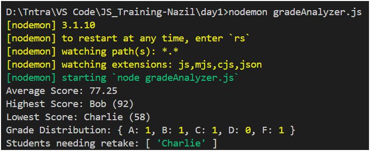

# JS Training

## Day 1 


### Student Grades Analysis — Explanation

This JavaScript program analyzes a list of students and their scores to generate useful insights such as:

1. Average Score — Calculates the average marks of all students.

2. Highest and Lowest Scores — Finds the student with the highest and lowest score along with their names.

3. Grade Distribution — Categorizes students into grades:
    - A: 90–100
    - B: 80–89
    - C: 70–79
    - D: 60–69
    - F: Below 60

4. Students Needing Retake — List of students who scored below 60 and need to retake the exam.

The program is modular and organized into separate helper functions:
- ```calculateAverage()``` → Computes the class average.
-  ```getMaxMinScore()``` → Finds max/min scores and corresponding student names.
-  ```getGradeDistribution()``` → Counts how many students fall into each grade category.
-  ```getFailedStudents()``` → Filters students who failed.

Finally, the main function ```analyzeGrades(students)``` combines all these operations and logs the results in the console.


### Sample Output:

