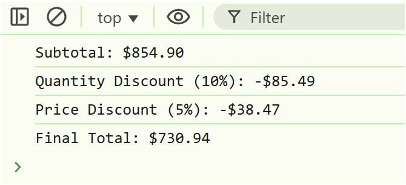

# JS Training

## Day 1 


### Student Grades Analysis — Explanation

This JavaScript program analyzes a list of students and their scores to generate useful insights such as:

1. Average Score — Calculates the average marks of all students.

2. Highest and Lowest Scores — Finds the student with the highest and lowest score along with their names.

3. Grade Distribution — Categorizes students into grades:
    - A: 90–100
    - B: 80–89
    - C: 70–79
    - D: 60–69
    - F: Below 60

4. Students Needing Retake — List of students who scored below 60 and need to retake the exam.

The program is modular and organized into separate helper functions:
- ```calculateAverage()``` → Computes the class average.
-  ```getMaxMinScore()``` → Finds max/min scores and corresponding student names.
-  ```getGradeDistribution()``` → Counts how many students fall into each grade category.
-  ```getFailedStudents()``` → Filters students who failed.

Finally, the main function ```analyzeGrades(students)``` combines all these operations and logs the results in the console.


### Sample Output:


## Day 2

### Shopping Cart App — Explanation

This task is a Vanilla JavaScript-based Shopping Cart System that fetches product data from a Fake Store API, displays products dynamically, and provides complete cart functionality — including add/remove items, discounts, and cart reset.

- ```fetchAllProducts()``` → Fetches all products from the Fake Store API.

- ```displayProducts()``` → Dynamically displays all products on the webpage with title, price, image, and rating.

- ```addToCart(product)``` → Adds a product to the cart or increases its quantity if it already exists.

- ```cartCalculation()``` → Calculates subtotal, total quantity, discounts, and final total of the cart.

- ```getDiscount(totalQuantity, actualPrice)``` → Applies 10% discount for >10 items and 5% discount if price > $500.

- ```getFinalTotal(subTotal, discount)``` → Returns the final amount after applying discounts.

- ```displayCart()``` → Displays all cart items, totals, discounts, and allows deleting items.

- ```deleteFromCart(productId)``` → Removes a specific product from the cart and updates totals.

- ```resetCart()``` → Clears all cart items and resets cart display.

- ```main()``` → Initializes the app, loads products, calculates cart totals, and attaches event listeners.


### Sample Output:

